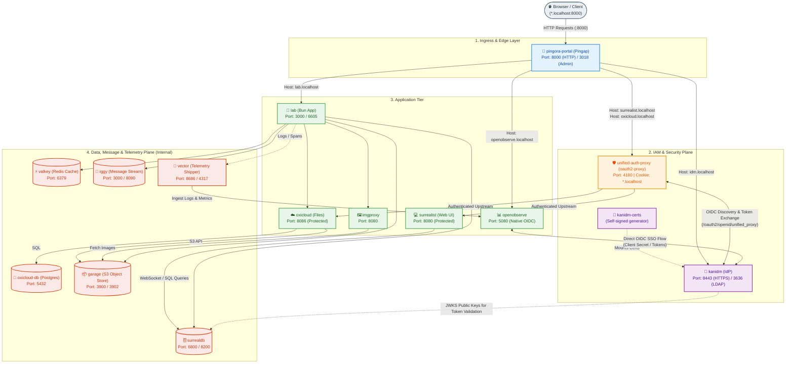

# Local lab

Subject to change -- fork it 👍



## Project Overview

This Lab Starter comes with the following:
[FILL THIS]

## Dependencies

Check the [shell.nix](./shell.nix) file.

## Setup

0. Install the packages requirements via `devenv.nix` file.
```sh
direnv allow .
```

1. Copy over the env folder
```sh
cp -r env.example env
```

Modify secrets or run with default (for local use), e.g.:
*   **`env/lab.env`**:
    *   `LAB_OPENOBSERVE_PASSWORD`

3. Launch it
```sh
docker-compose up --build
```

4. While the services are running, generate the master IAM password

```sh
lab-idm-gen-admin-pass
# or without devenv:
# docker compose exec -it kanidm kanidmd recover-account -c /etc/kanidm/server.toml admin
```

This should produce the following output:
```
ｉ [info]: Starting Kanidmd | version: 1.11.2
ｉ [info]: Running account recovery ...
ｉ [info]:  | new_password: "p8j*********************************************"
```

5. Login to the IDM at `http://idm.localhost:8000` using your newly generated password.

```yaml
username: admin
password: generated in step 4.
```

Login in the IAM will automatically connect you to all of the app services via the OCIP protocol.

6. You now have access to all services via localhost:8000

This setup will provide expose the following web application:
*   **Surrealist**: **http://surrealist.localhost:8000**
*   **Openobserve**: **http://openobserve.localhost:8000**
*   **Oxicloud**: **http://oxicloud.localhost:8000**

And open up thoses API urls:
*   **Lab**: **http://lab.localhost:8000**
*   **Imgproxy**: **http://imgproxy.localhost:8000**

## More information on current development

I am currently focus in adding workflow automation and client side UI for the lab and workflow visualization. The current auth setup (IAM + proxy) is too flimsy for production as is.
